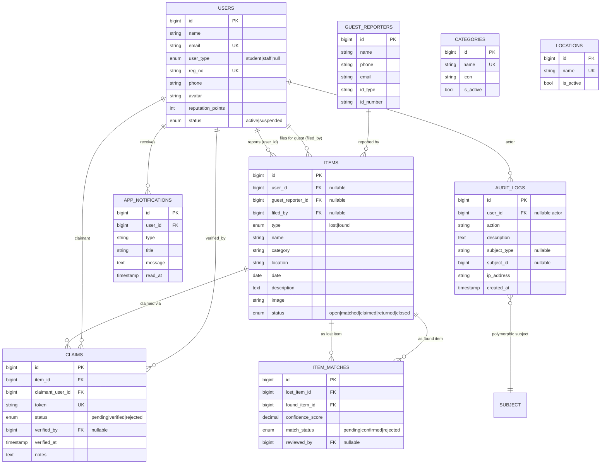

# Data Model

The schema is defined by the dated migrations in `database/migrations/`. This document gives
the entity-relationship diagram and a table-by-table reference.

## Entity-relationship diagram

Roles are managed by **spatie/laravel-permission** in its own tables (`roles`,
`permissions`, `model_has_roles`, `model_has_permissions`, `role_has_permissions`) —
a user's roles are a many-to-many via `model_has_roles`.

## Table reference

### `users`
Extends Laravel's default users table with University identity fields.

| Column | Type | Notes |
|--------|------|-------|
| `name`, `email` | string | `email` unique; also a login credential |
| `user_type` | enum `student\|staff`, nullable | Identity for the `student_staff` role; `null` for officer/admin |
| `reg_no` | string(50), unique | Institutional ID; **also a login credential**; read-only in profile |
| `phone` | string(20), nullable | |
| `avatar` | string, nullable | Path on the `public` disk |
| `reputation_points` | unsigned int, default 0 | Finder reputation (FR-E3); +10 on a verified claim |
| `status` | enum `active\|suspended`, default active | Suspended users are blocked by the `active` middleware |

### `guest_reporters`
A record — never a user account — for walk-in guests whose report an officer files.

| Column | Type | Notes |
|--------|------|-------|
| `name` | string | |
| `phone`, `email`, `id_type`, `id_number` | string, nullable | Contact & ID captured at the desk |

### `items`
One table for both lost and found reports (`type` distinguishes them).

| Column | Type | Notes |
|--------|------|-------|
| `user_id` | FK users, nullable, nullOnDelete | Registered reporter |
| `guest_reporter_id` | FK guest_reporters, nullable | Guest reporter (mutually exclusive with `user_id`) |
| `filed_by` | FK users, nullable | Officer who filed a guest report |
| `type` | enum `lost\|found` | |
| `name`, `category`, `location` | string, indexed | `category`/`location` are plain strings driven by the reference tables |
| `date` | date | When it was lost/found |
| `description`, `contact`, `image` | nullable | `image` is a `public`-disk path |
| `status` | enum `open\|matched\|claimed\|returned\|closed`, default open | Lifecycle |

### `item_matches`
Output of the matching engine — one row per surfaced lost/found pair.

| Column | Type | Notes |
|--------|------|-------|
| `lost_item_id`, `found_item_id` | FK items, cascade | Unique together |
| `confidence_score` | decimal(5,2) | 0.00–100.00 |
| `match_status` | enum `pending\|confirmed\|rejected` | |
| `reviewed_by` | FK users, nullable | |

### `claims`
A student/staff claim on a found item, verified in person by an officer.

| Column | Type | Notes |
|--------|------|-------|
| `item_id` | FK items, cascade | |
| `claimant_user_id` | FK users, cascade | |
| `token` | string(20), unique | Human-readable (e.g. `UNI-3805-A128`), shown to the claimant |
| `status` | enum `pending\|verified\|rejected`, default pending | |
| `verified_by`, `verified_at`, `notes` | nullable | Officer, timestamp, and rejection reason |

### `app_notifications`
Lightweight in-app notifications (separate from Laravel's `notifications` table).

| Column | Type | Notes |
|--------|------|-------|
| `user_id` | FK users, cascade | Recipient |
| `type`, `title`, `message` | string/text | `type` drives the icon |
| `read_at` | timestamp, nullable | Null = unread |

### `categories` / `locations`
Admin-managed reference lists that populate the report forms (FR-F2).

| Column | Type | Notes |
|--------|------|-------|
| `name` | string, unique | |
| `icon` | string, nullable | *(categories only)* Tabler icon suffix |
| `is_active` | bool, default true | Inactive entries are hidden from forms but keep existing items valid |

### `audit_logs`
Immutable activity trail (FR-F4) — insert & read only (no `updated_at`).

| Column | Type | Notes |
|--------|------|-------|
| `user_id` | FK users, nullable, nullOnDelete | The actor (`null` = system) |
| `action` | string, indexed | Machine key, e.g. `claim.verified` |
| `description` | text | Human-readable summary |
| `subject_type` / `subject_id` | nullable morph | The affected record |
| `ip_address` | string(45), nullable | |
| `created_at` | timestamp, indexed | No `updated_at` (immutable) |

## Status lifecycles

**Item:** `open` → `matched` (engine found a candidate) → `claimed` (a claim submitted) →
`returned` (claim verified) — or `closed` (officer retires an unclaimed found item). A
rejected claim sends a `claimed` item back to `open`.

**Claim:** `pending` → `verified` (item returned, finder rewarded) or `rejected` (with a
reason; item reopened).
